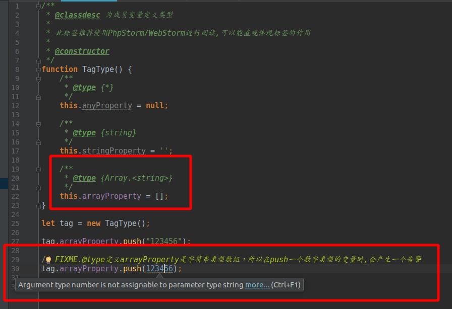
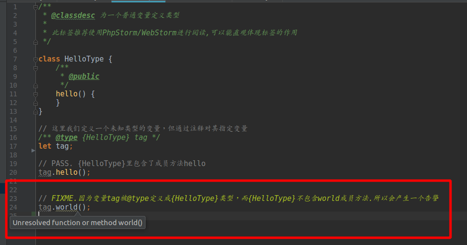
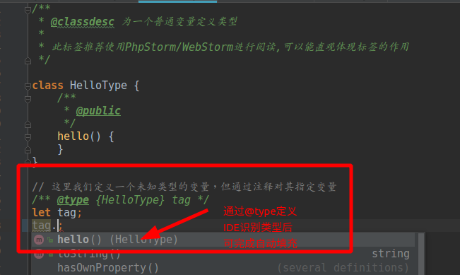

# @type

`@type` : 记录一个对象的类型。

**此标签推荐使用PhpStorm/WebStorm进行阅读,可以能直观体现标签的作用**

## 语法

> `@type {typeName}`

## 概述

类型表达式可以有以下几种表达形式

- 标识符的namepath(例如，myNamespace.MyClass)
- 一个内置的javascript类型(如string, number)
- 以上两种的组合

## type基础类型
| 类型 | 说明 |
|---|---|
|string | 字符串 |
|Array or Type[] | 数组 |
|number | 数字 |
|Object | 对象|
|Class | 自定义的类名|
|Function | 方法类型|
|null | -|
|* | 任意类型|

## type格式

<table>
    <tr>
        <th>类型名</th>
        <th>语法示例</th>
        <th>描述</th>
    </tr>
    <tr>
        <td>Symbol name</td>
        <td>{boolean}   {myNamespace.MyClass}</td>
        <td>指定符号的名称。 如果标识符已经被文档化，JSDoc将创建一个链接到该标识符的文档</td>
    </tr>
    <tr>
        <td>Multiple types</td>
        <td>{number|boolean}   表示数字或布尔</td>
        <td>这意味着值可能是几种类型中的一种，并用<b>|</b>分隔类型的完整列表。</td>
    </tr>
    <tr>
        <td>Arrays</td>
        <td>{Array.string} or string[]   表示字符串数组</td>
        <td>-</td>
    </tr>
    <tr>
        <td>Objects</td>
        <td>{name: string, age : number} or Object</td>
        <td>-</td>
    </tr>
    <tr>
        <td>Nullable type</td>
        <td>一个数字或null {?number}</td>
        <td>指明类型为指定的类型，或者为null。 </td>
    </tr>
    <tr>
        <td>Non-nullable type</td>
        <td>一个数字，但是绝对不会是null {!number} </td>
        <td>指明类型为指定的类型，但是绝对不会是null。</td>
    </tr>
    <tr>
        <td>Variable number of that type</td>
        <td>此函数接受可变数量的数值参数。 @param {...number} num </td>
        <td>表示该函数接受可变数量的参数，并指定一个类型的参数</td>
    </tr>
    <tr>
        <td>Optional parameter</td>
        <td>一个可选参数   @param {number} [foo]   @param {number} [foo=1] 可选参数，默认值=1</td>
        <td>指示参数是可选的。当使用JSDoc的语法表示可选参数时，你还可以指明参数的默认值。 </td>
    </tr>
</table>

## 标签效果

### @type标记成员变量

### @type标记普通变量

### IDE自动填充标记变量

**合理的通过@type标记，可以让IDE对标记的变量类型自动识别**
**例如识别到一个类，IDE会自动填充类的成员方法.可以有效的提升开发效率**

