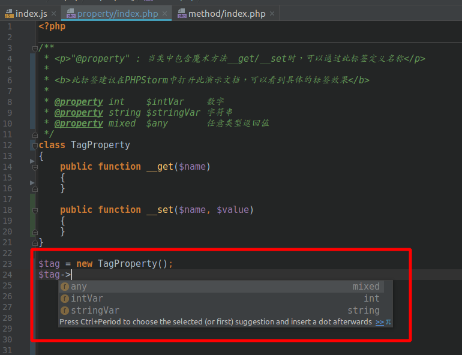
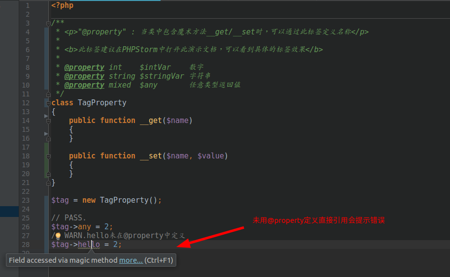

@property
=======

`@property` : 当类中包含魔术方法__get/__set时，可以通过此标签定义名称.

**此标签推荐使用PhpStorm进行阅读,可以能直观体现标签的作用**

语法
=======

> `@property [Type] [name] [<description>]`

使用场景
=======
当一个类用魔术方法`__get`或者`__set`去代理执行类成员变量时，对于调用方来讲是很迷茫的，因为调用方是无法知道具体有哪些成员.
通过引入`@property`可以解决这个问题，可以在类注释添加`@property`定义成员变量，这样调用法可以通过查看注释即可知道具体有哪些成员变量可以使用，部分IDE可直接识别`@property`标签从而实现自动填充以及类型判断．

变量列表
=======
| 变量类型 | 说明 |
|---|---|
|string | 字符串|
|integer/int | number/int类型 |
|boolean/bool | false/true |
|float/double | number/浮点数 |
|object | 对象实例|
|mixed | 任意类型|
|array/SpecifiedType[] | 数组，可以指定成指定类型的数组|
|resource | 文件资源类型|
|void | 无返回值|
|null | -|
|callable | 可执行的闭包函数|
|function | 闭包方法，但是不一定能执行|
|self/$this | 当前实例|

标签效果
=======

IDE自动提示
=======

最终效果
=======

